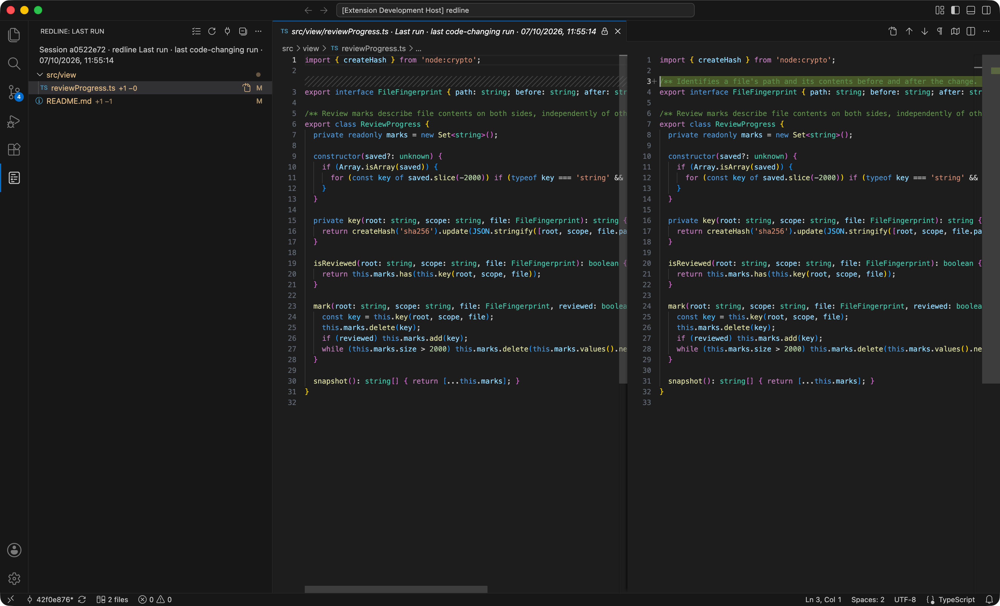
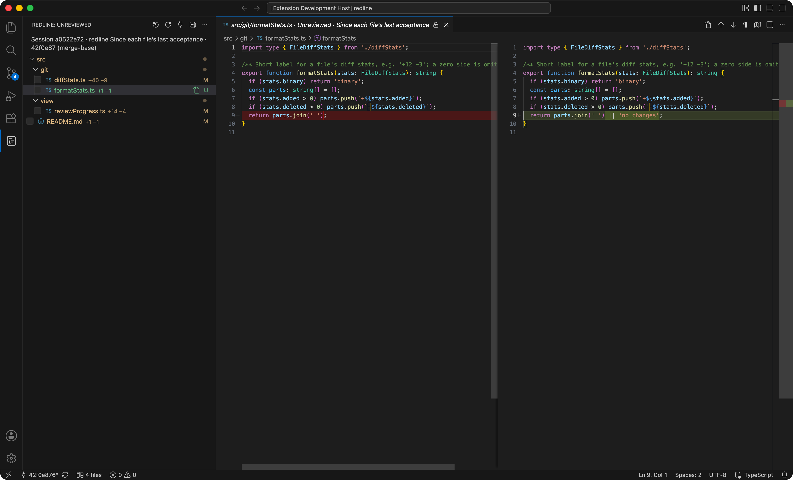

# Redline

See exactly what Claude Code just changed. Redline detects the files Claude Code changes while it works on a prompt in your session and shows them as a native VS Code diff: your code before the prompt on the left, after it on the right.

Keep talking to Claude in the terminal as usual. Redline gives you two ways to look at what it did:

- **Last Run** — only what Claude’s latest prompt changed.
- **Unreviewed** — a checklist of every file changed across all prompts, which you tick off as you read them.



## How Redline detects Claude Code’s changes

The Redline plugin for Claude Code uses three hooks to mark the boundaries of every prompt:

- **`UserPromptSubmit`** — when you send a prompt, the recorder snapshots the worktree.
- **`Stop`** — when Claude finishes, it snapshots the worktree again. The difference between the two snapshots is that prompt’s run.
- **`StopFailure`** — closes the run when a prompt ends in an error instead of finishing normally.

Snapshots are Git trees built in scratch indexes, so your real index and working tree are never touched. They cover edits, added and deleted files, renames, binaries, executable permissions, and files Claude creates through shell commands. Untracked files that Git ignores are left out.

Runs are recorded per Claude Code session and per worktree, so two sessions never mix. A prompt that only answers a question and changes no files leaves the previous run on screen.

Records live under `~/.claude/redline/repo-<hash>/runs.json`. Snapshot and acceptance refs live under `refs/redline/` in the repository, which keeps saved content safe from ordinary Git garbage collection. The extension only watches the run record. It does not read transcripts, poll agent processes, inject prompts, or connect to a terminal.

## Set up

You need Git, Node.js, and Claude Code. No API key or extra billing: Redline works with your existing Claude Code subscription.

### 1. Install the extension

In VS Code, open the Extensions view, search for **Redline**, and click **Install**.

### 2. Add the recorder to Claude Code

Redline learns what Claude Code changed through a small Claude Code plugin. To add it:

1. Run **Redline: Set Up Claude Code Plugin**, from the **⋯** menu of the Redline view or the Command Palette. It copies a setup prompt to your clipboard.
2. Paste it into Claude Code and send it.
3. Restart Claude Code (`claude --continue` brings back your conversation).

### 3. Try it

Ask Claude to change some code and wait for it to finish. Then run **Redline: Show Changes** from the Command Palette: the files Claude changed are listed, and clicking one opens the diff.

### Updating and removing

To update the recorder, run **Set Up Claude Code Plugin** again, paste the prompt into Claude Code, and restart Claude Code.

To remove it, run `claude plugin uninstall redline@redline` and `claude plugin marketplace remove redline`.

## Two modes

Open Redline from its icon in the Activity Bar on the left, or run **Redline: Show Changes**. Switch between the two modes with the button in the view title.

### Last Run: what the last prompt changed

Last Run lists the files your session’s latest completed prompt changed, with added and removed line counts. Click a file to open its before/after diff.

The comparison is saved the moment the prompt finishes, so it shows exactly what that prompt did, even if you or Claude edit the files afterwards. A prompt that only answers a question and changes nothing keeps the previous run on screen. The diffs are read-only for that reason; use **Open Working File for Editing**, in the file row or the diff toolbar, to edit the current file.

### Unreviewed: a checklist of everything you have not read

Unreviewed is for following a whole piece of work, not a single prompt. It lists every file that changed since you last looked at it, across all prompts, and each diff shows the file as it is now against the version you last marked as read.



- **Tick a file** once you have read it. It leaves the list.
- **If the file changes again**, by Claude or by you, it comes back, and its diff shows only what changed since you ticked it. In the screenshot, `formatStats.ts` was ticked earlier and is back with just the one line Claude changed afterwards.
- **Mark All Reviewed** in the view’s **⋯** menu ticks everything at once, and **Next Unreviewed File** opens the next one.
- Ticking is refused if the file changed while you were reading it, so a newer version is never marked as read by accident.

Unreviewed starts from your branch’s merge-base with the default branch (see `redline.reviewBase` below), so it also includes your own edits, not only Claude’s.

### Sessions

Redline shows the most recently active Claude Code session in this repository. To look at another session, including one in a separate Git worktree, choose it with the plug button in the view title; Redline remembers the choice. You can drag the Redline view to the bottom panel or the secondary sidebar like any other view.

## Boundaries to know

- Last Run describes filesystem changes between the prompt boundaries. Edits made manually or by another process in the same worktree during that interval can be included. Use separate worktrees for concurrent agents.
- When Claude reports background tasks still in flight, the recorder waits for a later Stop with no pending tasks. A long-running monitor can therefore keep the prompt pending.
- An interrupted prompt has no normal Stop boundary. Its partial edits remain available in Unreviewed; they are not attributed to the next completed prompt.
- Supported rebases are removed from the Last Run comparison. If a rebase is unfinished or cannot be separated safely, the viewer reports that the comparison is unavailable.
- Unreviewed includes current branch and working-tree changes, including your own edits. Its initial baseline is the review base, not only the last Claude prompt. A different branch/base has its own acceptance baseline.
- Unsaved editor changes are included in Unreviewed. Claude’s boundary snapshots reflect disk content.
- Deleted files retain their saved diff but cannot be opened for editing unless an existing dirty buffer still exists. Submodule content is not compared as a regular file.

## Settings

| Setting | Default | Purpose |
| --- | --- | --- |
| `redline.reviewBase` | `auto` | Unreviewed starts at the default branch merge-base. Set a ref such as `origin/main` explicitly. In a local-only repository, auto keeps the recorded pre-run HEAD (or first observed HEAD) as the review base. |
| `redline.showStatusBar` | `true` | Show the current file count and a shortcut to the viewer. |
| `redline.trace` | `errors` | Output channel verbosity: `off`, `errors`, or `verbose`. |

## Development

```sh
npm ci
npm test
npm run lint
npm run test:integration
npm run package
```

To test the companion from a checkout instead of GitHub, register the repository as a local Claude Code marketplace:

```sh
claude plugin marketplace add /absolute/path/to/local-review
claude plugin install redline@redline
# If already installed from this local marketplace:
claude plugin update redline@redline
```

Integration tests use an isolated VS Code profile and temporary workspace. They do not contact your live Claude sessions.
